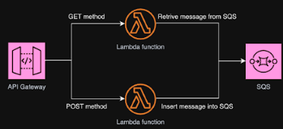

# IaC Challenge

## Overview

This project implements a serverless API using AWS CDK, consisting of an API Gateway, Lambda functions, and an SQS queue. It provides a robust infrastructure-as-code solution for deploying and managing serverless applications on AWS.

## Features

- Serverless architecture using AWS Lambda and API Gateway
- Asynchronous processing with SQS queue
- Infrastructure as Code (IaC) using AWS CDK
- GET and POST endpoints for API interaction
- Automated deployment and resource management

## Technology Stack


## Project Structure

- `steven_hu_question_1_stack.py`: Defines the main CDK stack with all AWS resources.
- `lambda_functions.py`: Contains the Lambda function handlers for GET and POST requests.

## Setup and Usage

### Prerequisites

- AWS CLI installed and configured
- Node.js installed
- Python 3.x installed
- AWS CDK Toolkit installed (`npm install -g aws-cdk`)

### Running the Application

1. Clone the repository:
   ```
   git clone https://github.com/stevenhu19817/iac-challenge.git
   cd iac-challenge
   ```

2. Create and activate a virtual environment:
   ```
   python -m venv .venv
   source .venv/bin/activate  # On Windows use: .venv\Scripts\activate.bat
   ```

3. Install the required dependencies:
   ```
   pip install -r requirements.txt
   ```

4. Bootstrap your AWS environment (if not done before):
   ```
   cdk bootstrap
   ```

5. Deploy the stack:
   ```
   cdk deploy
   ```

6. Note the API Gateway endpoint URL from the deployment output.

## API Documentation

### POST Request

- **URL**: Provided in the deployment output
- **Method**: POST
- **Content-Type**: application/json

#### Example Request:
```
curl -X POST -H "Content-Type: application/json" -d '{"EventName": "User Paid", "Value": "6.99"}' https://i1sogjbq9i.execute-api.us-east-1.amazonaws.com/prod/
```

### GET Request

- **URL**: Provided in the deployment output
- **Method**: GET

#### Example Request:
```
curl https://i1sogjbq9i.execute-api.us-east-1.amazonaws.com/prod/
```

## Testing

To test the API, use the curl commands provided in the API Documentation section above.

## Cleanup

To avoid incurring future charges, destroy the resources when you're done:
```
cdk destroy
```